<p align="center">
  
</p>

<p align="center">
  
  
  
</p>

# Project 08: Complete CI/CD Pipeline - Dev to QA to Prod

This project explains a complete GitHub Actions CI/CD flow for Terraform infrastructure promotion across environments.

> Goal: Students should clearly understand when Terraform **plan** runs, when Terraform **apply** runs, and how code is promoted branch by branch.

---

## Branch Flow

| Step | Action | Workflow | Terraform Action |
|---|---|---|---|
| 1 | Feature branch raises PR to `sandbox` | `ci-sandbox.yml` | `terraform plan` |
| 2 | PR merged into `sandbox` | `cd-sandbox.yml` | `terraform apply` to sandbox AWS account |
| 3 | `sandbox` raises PR to `dev` | `ci-dev.yml` | `terraform plan` |
| 4 | PR merged into `dev` | `cd-dev.yml` | `terraform apply` to dev AWS account |
| 5 | `dev` raises PR to `qa` | `ci-qa.yml` | `terraform plan` |
| 6 | PR merged into `qa` | `cd-qa.yml` | `terraform apply` to qa AWS account |
| 7 | `qa` raises PR to `prod` | `ci-prod.yml` | `terraform plan` |
| 8 | PR merged into `prod` | `cd-prod.yml` | `terraform apply` to prod AWS account |

---

## Architecture Diagram

```mermaid
%%{init: {"theme": "base", "themeVariables": {"primaryColor": "#e0f2fe", "primaryBorderColor": "#2563eb", "lineColor": "#16a34a", "fontFamily": "Inter, Arial", "tertiaryColor": "#efe7ff"}}}%%
flowchart LR
  classDef branch fill:#dbeafe,stroke:#2563eb,stroke-width:2px,color:#111827;
  classDef pr fill:#fef3c7,stroke:#f59e0b,stroke-width:2px,color:#111827;
  classDef apply fill:#dcfce7,stroke:#16a34a,stroke-width:2px,color:#111827;
  classDef aws fill:#efe7ff,stroke:#7c3aed,stroke-width:2px,color:#111827;

  Feature["Feature Branch"]
  Sandbox["sandbox branch"]
  Dev["dev branch"]
  QA["qa branch"]
  Prod["prod branch"]

  PRSandbox["PR to sandbox - Terraform Plan"]
  ApplySandbox["Merge to sandbox - Terraform Apply"]
  SandboxAWS["Sandbox AWS Account"]

  PRDev["PR sandbox to dev - Terraform Plan"]
  ApplyDev["Merge to dev - Terraform Apply"]
  DevAWS["Dev AWS Account"]

  PRQA["PR dev to qa - Terraform Plan"]
  ApplyQA["Merge to qa - Terraform Apply"]
  QAAWS["QA AWS Account"]

  PRProd["PR qa to prod - Terraform Plan"]
  ApplyProd["Merge to prod - Terraform Apply"]
  ProdAWS["Prod AWS Account"]

  Feature --> PRSandbox --> Sandbox --> ApplySandbox --> SandboxAWS
  Sandbox --> PRDev --> Dev --> ApplyDev --> DevAWS
  Dev --> PRQA --> QA --> ApplyQA --> QAAWS
  QA --> PRProd --> Prod --> ApplyProd --> ProdAWS

  class Feature,Sandbox,Dev,QA,Prod branch
  class PRSandbox,PRDev,PRQA,PRProd pr
  class ApplySandbox,ApplyDev,ApplyQA,ApplyProd apply
  class SandboxAWS,DevAWS,QAAWS,ProdAWS aws
```



---

## Repository Files

| File | Purpose |
|---|---|
| `.github/workflows/ci-sandbox.yml` | PR to `sandbox` runs Terraform plan |
| `.github/workflows/cd-sandbox.yml` | Push/merge to `sandbox` runs Terraform apply |
| `.github/workflows/ci-dev.yml` | PR to `dev` runs Terraform plan |
| `.github/workflows/cd-dev.yml` | Push/merge to `dev` runs Terraform apply |
| `.github/workflows/ci-qa.yml` | PR to `qa` runs Terraform plan |
| `.github/workflows/cd-qa.yml` | Push/merge to `qa` runs Terraform apply |
| `.github/workflows/ci-prod.yml` | PR to `prod` runs Terraform plan |
| `.github/workflows/cd-prod.yml` | Push/merge to `prod` runs Terraform apply |
| `terraform/provider.tf` | Terraform and AWS provider configuration |
| `terraform/backend.tf` | S3 backend configuration for remote state |
| `terraform/main.tf` | Simple private S3 bucket resources |
| `terraform/var.tf` | Input variables |
| `terraform/outputs.tf` | Terraform outputs |
| `terraform/env/sandbox.tfvars` | Sandbox environment values |
| `terraform/env/dev.tfvars` | Dev environment values |
| `terraform/env/qa.tfvars` | QA environment values |
| `terraform/env/prod.tfvars` | Prod environment values |

---

## AWS Credentials / Role and Region in Same Workflow File

This project keeps AWS configuration directly inside each workflow file.

Sandbox uses access key credentials directly in the workflow:

```yaml
- name: Configure AWS credentials
  uses: aws-actions/configure-aws-credentials@v4
  with:
    aws-access-key-id: SANDBOX_AWS_ACCESS_KEY_ID
    aws-secret-access-key: SANDBOX_AWS_SECRET_ACCESS_KEY
    aws-region: us-east-1
```

Dev, QA, and Prod use role ARN directly in the workflow.

Replace the sample account IDs with your real AWS account IDs:

| Environment | Role ARN in workflow |
|---|---|
| sandbox | Uses access key credentials directly |
| dev | `arn:aws:iam::222222222222:role/GitHubActionsTerraformDevRole` |
| qa | `arn:aws:iam::333333333333:role/GitHubActionsTerraformQARole` |
| prod | `arn:aws:iam::444444444444:role/GitHubActionsTerraformProdRole` |

Example role-based workflow:

```yaml
- name: Configure AWS credentials
  uses: aws-actions/configure-aws-credentials@v4
  with:
    role-to-assume: arn:aws:iam::222222222222:role/GitHubActionsTerraformDevRole
    aws-region: us-east-1
```

---

## Terraform Test Project

This repo includes a small Terraform project to test the CI/CD flow. It creates one private S3 bucket per environment.

```text
terraform/
├── backend.tf
├── main.tf
├── outputs.tf
├── provider.tf
├── var.tf
└── env/
    ├── sandbox.tfvars
    ├── dev.tfvars
    ├── qa.tfvars
    └── prod.tfvars
```

Each environment has a separate tfvars file:

```text
terraform/env/sandbox.tfvars
terraform/env/dev.tfvars
terraform/env/qa.tfvars
terraform/env/prod.tfvars
```

Each workflow has variables in the same YAML file:

```yaml
env:
  TF_WORKING_DIR: terraform
  TF_VAR_FILE: env/sandbox.tfvars
  TF_BACKEND_KEY: github-actions-cicd/sandbox/terraform.tfstate
```

The `TF_BACKEND_KEY` value keeps Terraform state separate for each environment:

```text
github-actions-cicd/sandbox/terraform.tfstate
github-actions-cicd/dev/terraform.tfstate
github-actions-cicd/qa/terraform.tfstate
github-actions-cicd/prod/terraform.tfstate
```

Before running workflows, create the backend bucket mentioned in `terraform/backend.tf` or replace it with your own existing Terraform state bucket name.

To test locally:

```bash
cd terraform
terraform init -backend-config="key=github-actions-cicd/sandbox/terraform.tfstate"
terraform validate
terraform plan -var-file=env/sandbox.tfvars
```

---

## How Students Use This Flow

### 1. Feature to Sandbox

```bash
git checkout -b feature/vpc-change
git add .
git commit -m "Update Terraform infra"
git push origin feature/vpc-change
```

Open PR:

```text
feature/vpc-change -> sandbox
```

This runs:

```text
ci-sandbox.yml -> terraform plan
```

After approval, merge PR into `sandbox`.

This runs:

```text
cd-sandbox.yml -> terraform apply
```

---

### 2. Sandbox to Dev

Open PR:

```text
sandbox -> dev
```

This runs:

```text
ci-dev.yml -> terraform plan
```

After approval, merge into `dev`.

This runs:

```text
cd-dev.yml -> terraform apply
```

---

### 3. Dev to QA

Open PR:

```text
dev -> qa
```

This runs:

```text
ci-qa.yml -> terraform plan
```

After approval, merge into `qa`.

This runs:

```text
cd-qa.yml -> terraform apply
```

---

### 4. QA to Prod

Open PR:

```text
qa -> prod
```

This runs:

```text
ci-prod.yml -> terraform plan
```

After approval, merge into `prod`.

This runs:

```text
cd-prod.yml -> terraform apply
```

---

## Manual Run

All workflows include:

```yaml
workflow_dispatch:
```

That means you can manually run any workflow from GitHub Actions tab.

